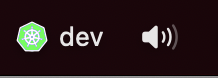
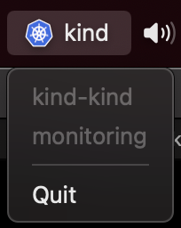

# golang-kubectx-tray

Small Menu Bar App to quickly identify the current Kubernetes Context:



Clicking on it we will show the full name of the current context (first line) and the current namespace (second line):



## Table of Contents

- [Table of Contents](#table-of-contents)
- [Configuration](#api-implementation)
- [Installation](#installation)
    - [Build and install on Mac](#build-and-install-on-mac)
    - [Build and install on Linux](#build-and-install-on-linux)
    - [Build and install on Windows](#build-and-install-on-windows)

## Configuration

Using the **~/.kube/kct-config** configuration file we can choose an icon and some small text to be shown on the tray:

```
contexts:
- match: preprod.k8s
  title: preprod
  icon: yellow
- match: devel.k8s
  title: dev
  icon: green
- match: kind-
  title: kind
```

The current list of available icons is:

* **kube**: 
* **green**: 
* **yellow**: 
* **red**: 
* **loki**: 
* **odin**: 
* **greenproc**: 
* **yellowproc**: 
* **redproc**: 

Please submit a PR if you want to add more, in the **icons** folder you can find the icon plus the [2goarray](https://github.com/cratonica/2goarray) version of it.

## Installation

It's currently only tested on **MacOS**.

### Build and install on Mac

To build this application you can simply run `make`. It will create the binary file under **KubeCtxTray.app** so you can just drag it into your applications folder.

### Build and install on Linux

It's not tested, but it should work file. Please follow [getlantern/systray](https://github.com/getlantern/systray) instructions for installing it's dependencies.

### Build and install on Windows

Please submit a PR if you get it working on Windows.